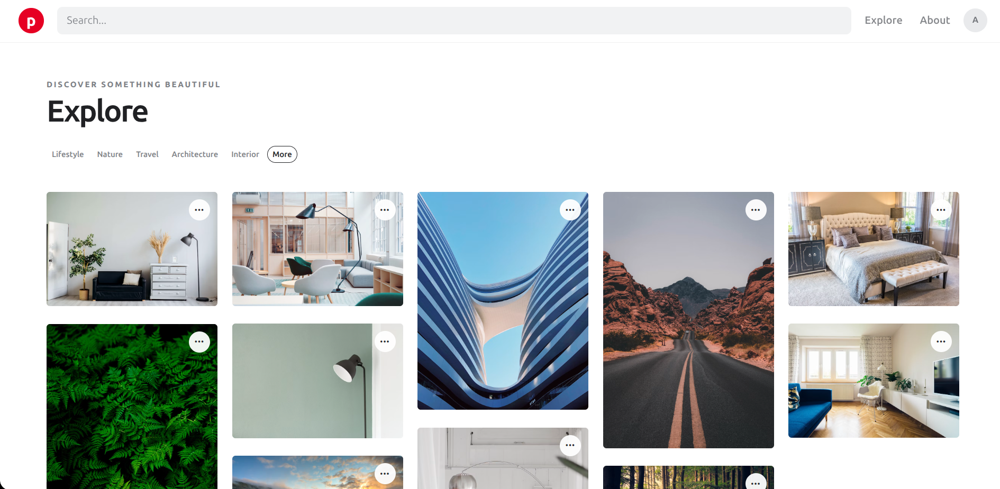
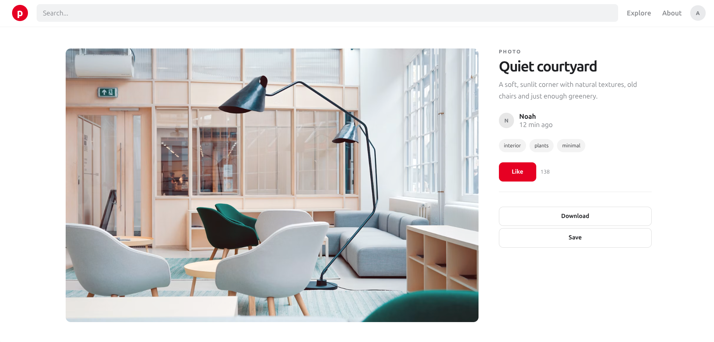
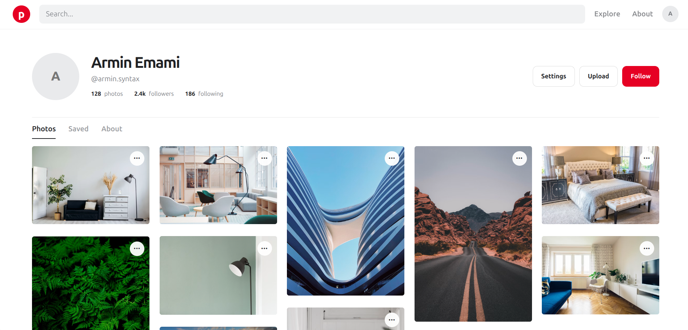
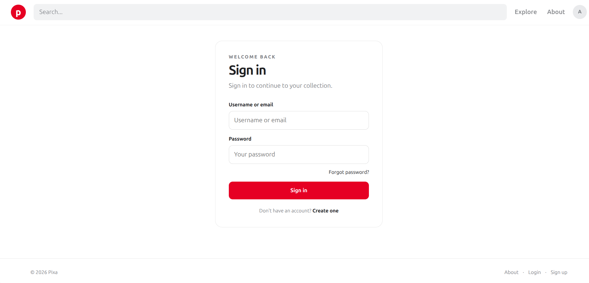

# **Pixa**

A clean, minimal, responsive photo-sharing platform inspired by modern visual discovery platforms such as Pinterest and Unsplash.

Pixa allows users to discover photos, upload and manage their own content, interact with other users, follow profiles, like and save photos, and manage their accounts.

The project was built with Django and focuses on keeping the application simple, clean, and easy to extend.

## **✨ Features**

### **📸 Photos**

* Explore photo feed
* Upload photos
* Photo detail pages
* Photo titles and captions
* Photo tags
* Like / unlike photos
* Save / unsave photos
* Saved photos page
* Photo ownership and management

### **👤 Users & Profiles**

* User profiles
* Profile information
* User photo galleries
* Follow / unfollow users
* Followers and following relationships
* Profile-based photo discovery

### **🔐 Authentication**

* User registration
* Login
* Logout
* Password reset
* Password reset email flow
* Custom password reset templates
* Django authentication views
* Authentication-aware navigation and pages

### **🎨 UI & UX**

* Responsive design
* Pinterest-style masonry photo layout
* Clean and minimal interface
* Responsive navigation
* Reusable UI components
* Custom forms and authentication templates
* Custom error pages
* Photo action menus
* User-friendly alerts and messages

### **📄 Pages**

Pixa currently includes:

* Explore
* About
* Register
* Login
* Logout
* Profile
* Upload Photo
* Photo Detail
* Saved Photos
* Password Reset
* Password Reset Done
* Password Reset Confirm
* Password Reset Complete
* 404 Error Page

## **🛠 Tech Stack**

### **Backend**

* Python
* Django
* Django Authentication
* Django Templates
* Django ORM

### **Frontend**

* HTML5
* CSS3
* Vanilla JavaScript

The project does not require a frontend framework such as React or Vue.

Django handles the server-side rendering, authentication, database interaction, and application logic.

### **Database**

* SQLite for development
* PostgreSQL for production

### **Deployment**

* Docker
* Docker Compose
* Gunicorn
* Nginx
* PostgreSQL

### **Development**

* Git
* GitHub

## **🏗 Architecture**

Pixa follows a traditional Django server-rendered architecture.

### **Development**

```text
Browser
   │
   ▼
Django Development Server
   │
   ▼
SQLite
```

### **Production**

```text
Browser
   │
   ▼
Nginx
   │
   ▼
Gunicorn
   │
   ▼
Django
   │
   ▼
PostgreSQL
```

## **🔐 Authentication**

Pixa uses Django's built-in authentication system.

The authentication flow includes:

```text
Register
   │
   ▼
Login
   │
   ├── Logout
   │
   └── Authenticated User
          │
          ├── Profile
          ├── Upload Photo
          ├── Like / Unlike
          ├── Save / Unsave
          └── Follow / Unfollow

Forgot Password
   │
   ▼
Password Reset Email
   │
   ▼
Reset Password
   │
   ▼
Password Reset Complete
```

The password reset functionality is based on Django's built-in authentication views, with custom templates to match the Pixa interface.

## **🗃️ Core Functionality**

### **Follow System**

Users can follow and unfollow other users.

The relationship allows Pixa to represent:

```text
User
 ├── Followers
 └── Following
```

### **Like System**

Users can like or unlike photos.

Each photo can have multiple likes while preventing duplicate likes from the same user.

### **Save System**

Users can save photos for later.

Saved photos are available from the user's saved photos page.

### **Photo Upload**

Authenticated users can upload photos with information such as:

```text
Photo
 ├── Image
 ├── Title
 ├── Caption
 ├── Author
 ├── Tags
 ├── Created At
 └── Updated At
```

The upload functionality is restricted to authenticated users.

## **🎨 Design**

Pixa follows a minimal visual direction:

* Clean typography
* Simple spacing
* Subtle borders
* Minimal controls
* Responsive layouts
* Content-focused photo cards
* Neutral visual design
* Red accent color
* Minimal animations and visual effects

The goal is to make the interface easy to understand without unnecessary visual complexity.

## **📸 Screenshots**

A quick look at the main Pixa interfaces.

| Explore                             | Photo Details                                   |
| ----------------------------------- | ----------------------------------------------- |
|  |  |

| Profile                             | Authentication                  |
| ----------------------------------- | ------------------------------- |
|  |  |

## **🚀 Getting Started**

There are two ways to run Pixa during development:

1. Traditional Django setup
2. Docker development setup

For production, Pixa uses a pre-built Docker image published on Docker Hub.

---

### **Option 1 — Traditional Django Setup**

#### **1. Clone the repository**

```bash
git clone https://github.com/armin-syntax/django-pixa.git
cd django-pixa
```

#### **2. Create a virtual environment**

```bash
python3 -m venv venv
```

Activate it:

```bash
source venv/bin/activate
```

On Windows:

```bash
venv\Scripts\activate
```

#### **3. Install dependencies**

```bash
pip install -r requirements.txt
```

#### **4. Run migrations**

```bash
python manage.py migrate
```

#### **5. Create a superuser**

```bash
python manage.py createsuperuser
```

#### **6. Run the development server**

```bash
python manage.py runserver
```

Then open:

```text
http://127.0.0.1:8000/
```

---

### **Option 2 — Docker Development**

The Docker development setup builds the image locally and mounts the project source code into the container.

This allows source-code changes to be reflected without rebuilding the image.

From the project root:

```bash
docker compose -f docker-compose.development.yml up --build
```

Then open:

```text
http://127.0.0.1:8000/
```

The development Docker environment uses:

* Django development server
* SQLite
* Local source-code bind mount
* Django automatic code reloading

To stop the development environment:

```bash
docker compose -f docker-compose.development.yml down
```

## **🐳 Docker Production**

The production setup uses a pre-built Docker image published on Docker Hub.

### **Docker Image**

```text
arminsyntax/django-pixa:1.0.0
```

### **Docker Hub**

The Pixa production image is available on Docker Hub:

```text
https://hub.docker.com/r/arminsyntax/django-pixa
```

### **Production Configuration**

The production Docker Compose configuration and environment template are maintained in the GitHub repository.

The repository provides:

* `docker-compose.production.yml`
* `.env.example`
* Nginx configuration
* Project documentation

### **1. Clone the repository**

```bash
git clone https://github.com/armin-syntax/django-pixa.git
cd django-pixa
```

### **2. Create the environment file**

The repository contains `.env.example` with the required production environment variables.

Create your local `.env` file:

```bash
cp .env.example .env
```

Then update `.env` with values appropriate for your environment.

**Never commit `.env` or other files containing real secrets to the repository.**

### **3. Pull the production image**

```bash
docker pull arminsyntax/django-pixa:1.0.0
```

### **4. Start the production environment**

```bash
docker compose -f docker-compose.production.yml up -d
```

### **5. Check the running containers**

```bash
docker compose -f docker-compose.production.yml ps
```

### **6. View logs**

```bash
docker compose -f docker-compose.production.yml logs -f
```

### **7. Stop the production environment**

```bash
docker compose -f docker-compose.production.yml down
```

## **🏗️ Production Stack**

The production environment consists of:

```text
                    Browser
                       │
                       ▼
                     Nginx
                       │
                       ▼
                   Gunicorn
                       │
                       ▼
                    Django
                       │
                       ▼
                  PostgreSQL
```

Docker Compose manages the application containers and persistent volumes.

The production environment uses persistent Docker volumes for:

* PostgreSQL data
* Static files
* Uploaded media files

## **📦 GitHub and Docker Hub**

The project separates application source code from the published production image.

### **GitHub**

The GitHub repository contains the source code and deployment configuration:

```text
GitHub
│
├── Django source code
├── docker-compose.development.yml
├── docker-compose.production.yml
├── .env.example
├── Nginx configuration
├── requirements.txt
├── screenshots
├── README.md
└── LICENSE
```

### **Docker Hub**

Docker Hub contains the published production image:

```text
Docker Hub
│
└── arminsyntax/django-pixa:1.0.0
       │
       └── Pixa Django application
```

When using the published production image, there is no need to build the Django application image locally.

The deployment configuration is obtained from GitHub, while the application image is pulled from Docker Hub.

## **⚙️ Configuration**

For development, Pixa uses SQLite and development-specific Django settings.

For production, configuration is provided through environment variables.

Important production settings include:

* `SECRET_KEY`
* `DEBUG`
* `ALLOWED_HOSTS`
* `CSRF_TRUSTED_ORIGINS`
* Database configuration
* Static files
* Media files
* Email configuration
* Security settings

Sensitive configuration values should be stored in environment variables rather than committed to the repository.

The provided `.env.example` file documents the required production environment variables without containing real secrets.

## **🔄 Application Startup**

The production Docker container performs the required Django initialization steps when it starts.

The startup process includes:

1. Running database migrations
2. Collecting static files
3. Starting the application server

Gunicorn is used as the production application server.

## **🧪 Development**

The project is currently designed as a Django monolithic application:

```text
Django
├── Backend
├── Templates
├── Static Files
├── Authentication
└── Database
```

This approach keeps the application straightforward and makes it suitable for learning, experimentation, and further development.

### **Development vs Production**

#### Development

```text
Local Source Code
       │
       ▼
Docker Build
       │
       ▼
Django Development Server
       │
       ▼
SQLite
```

#### Production

```text
Docker Hub Image
       │
       ▼
Docker Container
       │
       ├── Gunicorn
       │
       └── Django
              │
              ▼
          PostgreSQL

Nginx
   │
   └── Reverse Proxy → Gunicorn
```

Production images are versioned using Docker tags.

Application changes require building and publishing a new image version before deploying that version to production.

## **🏷️ Docker Image Tags**

The production image uses versioned Docker tags.

Current version:

```text
1.0.0
```

Pull the current version with:

```bash
docker pull arminsyntax/django-pixa:1.0.0
```

Future releases can use additional versioned tags such as:

```text
1.1.0
2.0.0
```

Versioned tags make it possible to deploy a specific application version and use an earlier version when necessary.

## **🌐 Using Pixa on Another Machine**

The published production image can be used on another Docker host without building the Django application from source.

The target machine needs:

* Docker
* Docker Compose
* The Pixa GitHub repository
* `.env`
* `docker-compose.production.yml`
* Nginx configuration

Then:

```bash
git clone https://github.com/armin-syntax/django-pixa.git
cd django-pixa

cp .env.example .env

docker pull arminsyntax/django-pixa:1.0.0

docker compose -f docker-compose.production.yml up -d
```

The same production image can later be used on a VPS.

Server-specific configuration such as domain names, HTTPS/TLS certificates, and server-specific Nginx configuration should remain outside the Docker image.

## **🔐 Security**

Do not place real secrets inside the Docker image or commit them to GitHub.

Use environment variables for sensitive configuration such as:

* Django `SECRET_KEY`
* Database credentials
* Email credentials
* Other environment-specific values

The `.env.example` file is provided as a configuration template.

## **🔮 Future Improvements**

Possible future improvements include:

* Django REST Framework API
* React frontend
* AJAX / Fetch-based interactions
* Infinite scrolling
* Advanced photo search
* Tag-based filtering
* Pagination improvements
* Notifications
* User activity feed
* Comments
* Image optimization
* Cloud media storage
* Automated tests
* CI/CD with GitHub Actions

These features are not required for the current version of Pixa but could be added as the project evolves.

## **🤖 Why Was This Made?**

I'm primarily interested in backend development, and I don't want to spend most of my time building frontend interfaces.

For this project, the frontend was built with the assistance of AI so I could focus more on the Django backend, application logic, authentication, database design, and overall functionality.

The frontend source code is available in a separate repository:

**Frontend:** https://github.com/armin-syntax/pixa-template

Pixa started as a frontend interface and evolved into a complete Django application with authentication, user interactions, photo management, and responsive UI.

The goal was to build a simple and realistic project while keeping the focus on backend development.

## **📌 Inspiration**

The concept and visual direction are inspired by modern platforms focused on discovering and sharing visual content, including Pinterest and Unsplash.

Pixa is an independent project and is not affiliated with, sponsored by, or associated with either platform.

## **🤝 Contributing**

Contributions are welcome.

If you find a bug, have an idea for improving the application, or want to add a feature, feel free to open an issue or submit a pull request.

When contributing, please try to keep the code simple, readable, and consistent with the existing project structure.

## **📄 License**

This project is open source and licensed under the MIT License.

See the [`LICENSE`](LICENSE) file for the exact terms and conditions.

---

Built with Django and a lot of curiosity.
